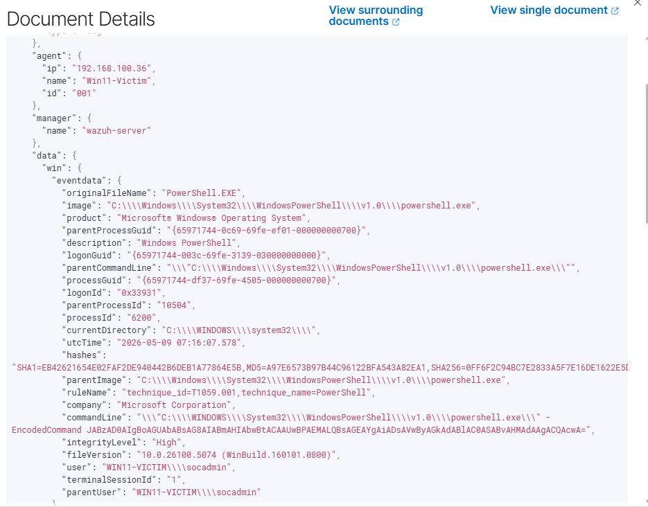
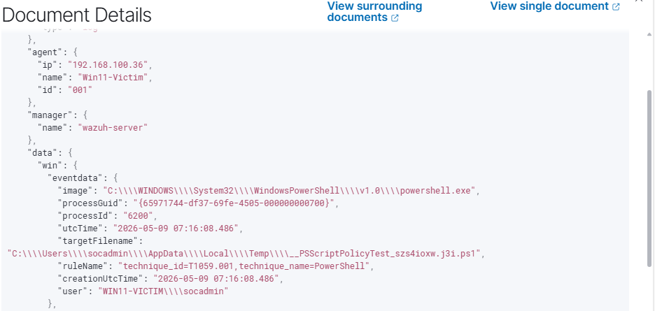

# 🛡️ Home SOC Laboratory — Wazuh + Sysmon + MITRE ATT&CK

🌐 **Language:** **English** | [Русский](README.ru.md)

[](https://wazuh.com/)
[](https://learn.microsoft.com/sysinternals/downloads/sysmon)
[](https://attack.mitre.org/)

A learning project documenting my first hands-on experience setting up a small SOC lab and detecting Windows attack techniques through it. Built end-to-end over ~2 weeks alongside university studies.

---

## 📋 What This Project Is

I'm a final-year Information Security student looking for an internship or junior position in SOC. I noticed that most of my coursework was theoretical, so I decided to build this lab to gain practical experience in:

- Deploying an open-source SIEM (Wazuh)
- Collecting endpoint telemetry through Sysmon
- Generating real Windows attack events and seeing how they look in a SIEM
- Reading and triaging SIEM alerts the way an L1 analyst does

This is **not** a production-grade setup — it's a learning artifact. Below I document what I built, what I learned, and what I'd do differently next time.

---

## 📂 Repository Structure

```
home-soc-lab/
├── README.md       — English project report
├── README.ru.md    — Russian version
├── LICENSE         — MIT License
└── images/         — Screenshots from Wazuh, Sysmon, and alert triage
```

---

## 🏗️ Architecture

```
┌─────────────────────────────────┐                  ┌─────────────────────────────────┐
│  WIN11-VICTIM (192.168.100.36)  │                  │  WAZUH-SERVER (192.168.100.83)  │
│  Windows 11 Enterprise Eval     │                  │  Amazon Linux 2023              │
│                                 │                  │                                 │
│  ┌───────────────────────────┐  │                  │  ┌───────────────────────────┐  │
│  │  Sysmon (sysmon-modular)  │  │                  │  │   Wazuh Manager           │  │
│  │  • Process Create (EID 1) │  │   port 1514/TCP  │  │   • Decoders + Rules      │  │
│  │  • File Create   (EID 11) │──┼─── (AES) ───────►│  │   • Alert Engine          │  │
│  │  • Registry Set  (EID 13) │  │                  │  └────────────┬──────────────┘  │
│  └─────────────┬─────────────┘  │                  │               │                  │
│                │                │                  │  ┌────────────▼──────────────┐  │
│  ┌─────────────▼─────────────┐  │                  │  │   Wazuh Indexer           │  │
│  │   Wazuh Agent v4.14.5     │  │                  │  │   (OpenSearch fork)       │  │
│  └───────────────────────────┘  │                  │  └────────────┬──────────────┘  │
│                                 │                  │  ┌────────────▼──────────────┐  │
│  ⚔️ Manual MITRE technique      │                  │  │   Wazuh Dashboard         │  │
│     simulation via PowerShell   │                  │  │   (web UI)                │  │
│                                 │                  │  └───────────────────────────┘  │
└─────────────────────────────────┘                  └─────────────────────────────────┘

Both VMs running in VirtualBox 7 on a single laptop (16 GB RAM, AMD Ryzen 7).
```

---

## 🔧 Tech Stack

| Component | Version | Role |
|-----------|---------|------|
| Wazuh | 4.14.5 | Open-source SIEM/XDR |
| Sysmon | 15.20 | Extended Windows event logging |
| sysmon-modular | latest | MITRE-aligned config for Sysmon (by Olaf Hartong) |
| VirtualBox | 7.x | Hypervisor |
| Windows 11 Enterprise Evaluation | 25H2 (Build 26200.6584) | Victim endpoint (90-day trial) |
| PowerShell | 5.1 | Attack simulation scripts |

---

## 🚀 What I Built

### 1. Wazuh Server
- Imported pre-built Wazuh OVA into VirtualBox
- 4 GB RAM, 2 vCPU, bridged networking
- Reached the dashboard at `https://<wazuh-server-ip>` using default lab credentials (must be rotated for any non-lab deployment)

### 2. Windows 11 Victim VM
- Installed Win11 Enterprise Evaluation manually (the unattended install hung — had to retry)
- 4 GB RAM, 2 vCPU, EFI enabled
- Disabled Defender real-time protection (lab-only, after disabling Tamper Protection through Windows Security GUI)
- Took a VirtualBox snapshot before any modifications — it saved me later

### 3. Sysmon
- Downloaded from Sysinternals, applied [sysmon-modular](https://github.com/olafhartong/sysmon-modular) configuration
- Installed via `Sysmon64.exe -accepteula -i sysmonconfig.xml`

### 4. Wazuh Agent + The Critical Config Step
- Installed via the dashboard's "Deploy new agent" wizard
- **Important detail I missed at first:** the default agent config does NOT subscribe to the Sysmon channel. So the agent connected, but no Sysmon events were flowing into the SIEM.
- Fixed by adding to `C:\Program Files (x86)\ossec-agent\ossec.conf`:

```xml
<localfile>
  <location>Microsoft-Windows-Sysmon/Operational</location>
  <log_format>eventchannel</log_format>
</localfile>
```

After restarting the agent (`Restart-Service -Name Wazuh`), Sysmon events started appearing in the dashboard.

---

## ⚔️ Attack Scenarios

I manually executed 7 PowerShell-based attack techniques on the victim. Originally I planned to use Atomic Red Team, but the GitHub download was throttled to ~23 KB/s from my region — so I ran each technique manually instead. This actually turned out to be more educational, because I now understand what each command does.

| # | MITRE ID | Technique | Tactic |
|---|----------|-----------|--------|
| 1 | T1059.001 | PowerShell — credential file search | Execution |
| 2 | T1059.003 | Windows cmd reconnaissance (whoami, net user, systeminfo) | Execution / Discovery |
| 3 | T1218.011 | Rundll32 (LOLBin) | Defense Evasion |
| 4 | T1547.001 | Registry Run Key persistence | Persistence |
| 5 | T1543.003 | Windows service creation | Persistence |
| 6 | T1003.001 | LSASS process access | Credential Access |
| 7 | T1027 | Encoded PowerShell (base64) | Defense Evasion |

> ⚠️ All attacks were run inside an isolated VM with snapshot rollback. **Never run these commands on production systems.** This project is for educational purposes only.

---

## 🔍 What Wazuh Caught

With filter `agent.name: Win11-Victim` in Threat Hunting (30-minute window after attack execution), Wazuh showed **49 MITRE-tagged alerts** plus many additional Sysmon events. Tactics that lit up on the MITRE matrix:

- Execution
- Persistence
- Privilege Escalation
- Defense Evasion
- Credential Access
- Command and Control

**Severity distribution:**
- Level 15 (Critical): 1 alert
- Level 12 (High): 3 alerts
- Level 5–10: 5 alerts
- Level 3–4: 40+ alerts


*MITRE ATT&CK Dashboard — after simulating 7 attacks, 6 tactics lit up. Shows alert distribution and a timeline of when they occurred.*


*Threat Hunting view — 58 alerts over a 30-minute window with filter `agent.name: Win11-Victim`. Specific rules visible: encoded PowerShell (level 12), file dropped (level 15), service creation (level 5), discovery activity (level 3).*


*Wazuh Endpoints Summary — agent Win11-Victim in Active status, version 4.14.5.*

---

## 🎯 Two Alerts I Analyzed

The most useful part of this project was practicing alert triage. Two alerts stood out as opposite cases.

### Alert 1 — True Positive: Encoded PowerShell (T1059.001)

**Rule 92057, Level 12** — *"Powershell.exe spawned a powershell process which executed a base64 encoded command"*


*Expanded JSON of the Level 12 alert. Key fields visible: `commandLine` with the `-EncodedCommand` flag and base64 blob, `integrityLevel: High`, `user: socadmin`, `parentProcessGuid` (parent is also PowerShell), `hashes` with SHA256 for TI feed lookups.*

Going through the JSON:

- User: `WIN11-VICTIM\socadmin`, integrityLevel **High**, interactive session
- Parent process is also `powershell.exe` (chain launching, classic obfuscation indicator)
- Command line has the `-EncodedCommand` flag with a base64 blob
- Decoded the base64 (PowerShell uses **UTF-16 Little Endian**, not UTF-8 — easy to mess up): `$s="hello from SOC-lab";Write-Host $s`

In our lab the payload is harmless, but **the pattern itself** (base64 + chain launching + admin privileges) is exactly what real attackers do. So I marked it as a True Positive and wrote a triage note.

### Alert 2 — False Positive: File Created in Temp (T1105)

**Rule 92213, Level 15** — *"Executable file dropped in folder commonly used by malware"*


*Expanded JSON of the Level 15 alert. Key field — `targetFilename` with value `__PSScriptPolicyTest_szs4ioxw.j3i.ps1`. Note: `processGuid` matches the `ProcessGuid` from the Level 12 alert above — meaning the file was created by the same PowerShell process, 1 second after launch.*

Level 15 sounded scary, but going through the JSON:

- Created file: `__PSScriptPolicyTest_szs4ioxw.j3i.ps1` in `AppData\Local\Temp\`
- Same `ProcessGuid` as encoded PowerShell — so **the same process** created the file 1 second later
- Filename `__PSScriptPolicyTest_*` is a documented internal mechanism of PowerShell itself for ExecutionPolicy validation

So this Level 15 turned out to be a **False Positive** — legitimate Windows behavior. The main takeaway: severity score does not equal real-world severity. You have to read the data first, then react.

A simple rule tuning to suppress this FP in production would look like:

```xml
<rule id="100100" level="0">
  <if_sid>92213</if_sid>
  <field name="win.eventdata.targetFilename">__PSScriptPolicyTest_</field>
  <description>FP suppression: PowerShell ExecutionPolicy test file</description>
</rule>
```

---

## 🧱 Real Challenges I Hit

Listing them honestly — this is where I learned the most:

- **Wazuh OVA wouldn't boot** with Secure Boot enabled — had to disable it in VM settings
- **Unattended Win11 install in VirtualBox hung** at the upgrade dialog — recreated the VM and installed manually
- **Atomic Red Team download was throttled** by GitHub (~23 KB/s) — had to switch to manual technique execution, which actually forced me to understand each command
- **Defender Tamper Protection blocked `Set-MpPreference`** from PowerShell — had to disable Tamper Protection through Windows Security GUI first, only then disable real-time protection
- **Sysmon events weren't reaching Wazuh** even though the agent was Active — turned out the default agent config doesn't subscribe to the Sysmon channel; needed to add `<localfile>` for `Microsoft-Windows-Sysmon/Operational` to `ossec.conf`
- **Network changed between sessions** (home Wi-Fi → mobile hotspot → home Wi-Fi) — IPs shifted, had to re-check connectivity. Going forward I'll use NAT Network in VirtualBox to be independent of physical networking
- **Host RAM was tight** — 16 GB with two 4 GB VMs plus a browser was unstable; had to close background apps (Discord, Steam, etc.) before each session

---

## 📈 What I Gained From This Project

Hands-on familiarity with:

- Wazuh dashboard navigation, agent enrollment, basic configuration
- Sysmon installation and applying a third-party MITRE-aligned config
- Reading raw Sysmon Event IDs (1, 11, 13) inside SIEM alerts
- Reading and decoding `-EncodedCommand` PowerShell payloads
- The 6-step alert triage workflow (read → context → reconstruct → decode → triage → action)
- Distinguishing True Positives from False Positives based on context, not severity
- Correlating events across processes via `ProcessGuid`

I am **not** claiming to be an expert in any of these — just that I've used them in practice on this lab.

---

## 📚 Lessons Learned

1. **Severity ≠ real-world impact.** The Level 15 alert I investigated turned out to be a False Positive (legitimate Windows behavior). The Level 12 was a real attack pattern. Always investigate before reacting.

2. **Default tool configurations are rarely sufficient.** The Wazuh agent will happily run for hours with no Sysmon visibility unless you tell it which channels to read. Reading documentation pays off.

3. **`ProcessGuid` is more reliable than `ProcessId` for correlation.** OS PIDs can be reused; ProcessGuid is unique forever.

4. **Plan around resource constraints.** A 16 GB laptop is workable for two VMs, but only if the host is kept clean. Background applications add up fast.

---

## 🚧 Next Steps I'd Like to Take

- Write a few of my own custom detection rules in `local_rules.xml` (so far I've only used the bundled rules)
- Add a Linux endpoint to compare cross-platform detection
- Try integrating Active Directory + Domain Controller for credential-theft scenarios

---

## 📖 References

- [Wazuh Documentation](https://documentation.wazuh.com/)
- [Sysmon (Microsoft Sysinternals)](https://learn.microsoft.com/sysinternals/downloads/sysmon)
- [sysmon-modular by Olaf Hartong](https://github.com/olafhartong/sysmon-modular)
- [MITRE ATT&CK Framework](https://attack.mitre.org/)

---

## 👤 About Me

**Erlan Pirmakhanov** — final-year Information Security student at Satbayev University (Almaty, Kazakhstan), GPA 3.68 / 4.0. Open to internship or junior SOC analyst roles.

This was my first end-to-end practical security project. Along the way, I leaned on official documentation and online write-ups. There's plenty I haven't covered yet (custom rule writing, real threat hunting queries, AD integration). Happy to discuss any part of this README in more detail at an interview.

📧 pirmakhanoverlan@gmail.com
https://hh.kz/resume/06a9299fff10757f930039ed1f79525a396257
