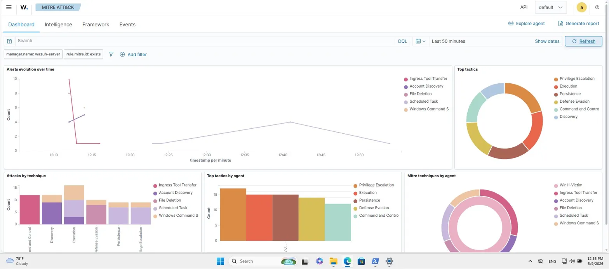
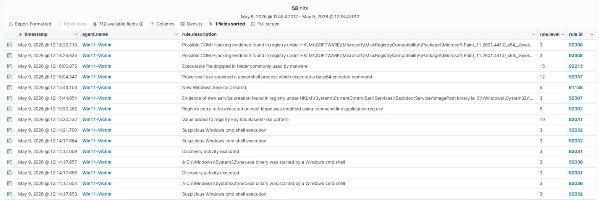
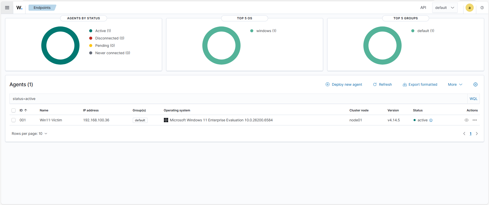

# 🛡️ Home SOC Laboratory — Wazuh + Sysmon + MITRE ATT&CK

[](https://wazuh.com/)
[](https://learn.microsoft.com/sysinternals/downloads/sysmon)
[](https://attack.mitre.org/)

Учебный проект, в котором я документирую свой первый практический опыт развёртывания небольшого SOC-лаба и детектирования атак на Windows. Сделан end-to-end за ~2 недели параллельно с учёбой.

---

## 📋 О проекте

Я — студент 4 курса по специальности «Информационная безопасность», ищу стажировку или junior-позицию в SOC. Заметил, что большая часть учёбы была теоретической, поэтому решил собрать этот лаб — чтобы получить практический опыт в:

- Развёртывании open-source SIEM (Wazuh)
- Сборе телеметрии с эндпоинтов через Sysmon
- Генерации реальных событий атак на Windows и наблюдении как они выглядят в SIEM
- Чтении и triage SIEM-алертов так, как это делает L1-аналитик

Это **не** production-grade установка — это учебный артефакт. Ниже описано что я построил, чему научился, и что бы сделал по-другому в следующий раз.

---

## 🏗️ Архитектура

```
┌─────────────────────────────────┐                  ┌─────────────────────────────────┐
│  WIN11-VICTIM (192.168.100.36)  │                  │  WAZUH-SERVER (192.168.100.83)  │
│  Windows 11 Enterprise Eval     │                  │  Amazon Linux 2023              │
│                                 │                  │                                 │
│  ┌───────────────────────────┐  │                  │  ┌───────────────────────────┐  │
│  │  Sysmon (sysmon-modular)  │  │                  │  │   Wazuh Manager           │  │
│  │  • Process Create (EID 1) │  │   port 1514/TCP  │  │   • Decoders + Rules      │  │
│  │  • File Create   (EID 11) │──┼─── (AES) ───────►│  │   • Alert Engine          │  │
│  │  • Registry Set  (EID 13) │  │                  │  └────────────┬──────────────┘  │
│  └─────────────┬─────────────┘  │                  │               │                  │
│                │                │                  │  ┌────────────▼──────────────┐  │
│  ┌─────────────▼─────────────┐  │                  │  │   Wazuh Indexer           │  │
│  │   Wazuh Agent v4.14.5     │  │                  │  │   (OpenSearch fork)       │  │
│  └───────────────────────────┘  │                  │  └────────────┬──────────────┘  │
│                                 │                  │  ┌────────────▼──────────────┐  │
│  ⚔️ Ручная симуляция MITRE      │                  │  │   Wazuh Dashboard         │  │
│     техник через PowerShell     │                  │  │   (web UI)                │  │
│                                 │                  │  └───────────────────────────┘  │
└─────────────────────────────────┘                  └─────────────────────────────────┘

Обе VM работают в VirtualBox 7 на одном ноутбуке (16 ГБ RAM, AMD Ryzen 7).
```

---

## 🔧 Стек технологий

| Компонент | Версия | Роль |
|-----------|--------|------|
| Wazuh | 4.14.5 | Open-source SIEM/XDR |
| Sysmon | 15.20 | Расширенное логирование событий Windows |
| sysmon-modular | latest | MITRE-aligned конфиг для Sysmon (автор Olaf Hartong) |
| VirtualBox | 7.x | Гипервизор |
| Windows 11 Enterprise Evaluation | 25H2 (Build 26200.6584) | Эндпоинт-жертва (90-day trial) |
| PowerShell | 5.1 | Скрипты для симуляции атак |

---

## 🚀 Что я сделал

### 1. Сервер Wazuh
- Импортировал готовый Wazuh OVA в VirtualBox
- 4 ГБ RAM, 2 vCPU, bridged-сеть
- Открыл дашборд по адресу `https://192.168.100.83` (admin / admin)

### 2. Виртуальная машина Win11 (жертва)
- Установил Win11 Enterprise Evaluation вручную (unattended install зависал — пришлось переустанавливать)
- 4 ГБ RAM, 2 vCPU, EFI включён
- Отключил real-time protection в Defender (только для лаба, после отключения Tamper Protection через Windows Security GUI)
- Сделал VirtualBox snapshot до любых изменений — потом это пригодилось

### 3. Sysmon
- Скачал с Sysinternals, применил конфиг [sysmon-modular](https://github.com/olafhartong/sysmon-modular)
- Установил через `Sysmon64.exe -accepteula -i sysmonconfig.xml`

### 4. Wazuh-агент + критическая настройка
- Установил через мастер «Deploy new agent» в дашборде
- **Важная деталь, которую пропустил сначала:** дефолтный конфиг агента НЕ подписан на канал Sysmon. Поэтому агент подключился, но события Sysmon никуда не уходили в SIEM.
- Исправил, добавив в `C:\Program Files (x86)\ossec-agent\ossec.conf`:

```xml
<localfile>
  <location>Microsoft-Windows-Sysmon/Operational</location>
  <log_format>eventchannel</log_format>
</localfile>
```

После рестарта агента (`Restart-Service -Name Wazuh`) события Sysmon начали появляться в дашборде.

---

## ⚔️ Сценарии атак

Я вручную выполнил 7 техник атак на машине-жертве. Изначально планировал использовать Atomic Red Team, но скачивание с GitHub было затроттлено до ~23 КБ/с из моего региона — поэтому запускал каждую технику вручную через PowerShell. Получилось даже полезнее: я разобрался, что делает каждая команда.

| # | MITRE ID | Техника | Тактика |
|---|----------|---------|---------|
| 1 | T1059.001 | PowerShell — поиск файлов с паролями | Execution |
| 2 | T1059.003 | Разведка через Windows cmd (whoami, net user, systeminfo) | Execution / Discovery |
| 3 | T1218.011 | Rundll32 (LOLBin) | Defense Evasion |
| 4 | T1547.001 | Persistence через Registry Run-key | Persistence |
| 5 | T1543.003 | Создание Windows-сервиса | Persistence |
| 6 | T1003.001 | Доступ к процессу LSASS | Credential Access |
| 7 | T1027 | Encoded PowerShell (base64) | Defense Evasion |

> ⚠️ Все атаки запускались внутри изолированной VM с возможностью отката через snapshot. **Никогда не запускайте такие команды на production-системах.** Этот проект — только для образовательных целей.

---

## 🔍 Что Wazuh поймал

С фильтром `agent.name: Win11-Victim` в Threat Hunting (окно 30 минут после запуска атак) Wazuh показал **49 алертов с MITRE-маппингом** плюс много дополнительных Sysmon-событий. Тактики, которые подсветились на матрице MITRE:

- Execution
- Persistence
- Privilege Escalation
- Defense Evasion
- Credential Access
- Command and Control

**Распределение по уровню серьёзности:**
- Level 15 (Critical): 1 алерт
- Level 12 (High): 3 алерта
- Level 5–10: 5 алертов
- Level 3–4: 40+ алертов


*MITRE ATT&CK Dashboard — после симуляции атак подсветились 6 тактик. Видно распределение алертов по тактикам и временной график их появления.*


*Threat Hunting view — 58 алертов за 30 минут с фильтром `agent.name: Win11-Victim`. Видны конкретные правила: encoded PowerShell (level 12), file dropped (level 15), service creation (level 5).*


*Wazuh Dashboard — главный обзор с агентом Win11-Victim в статусе Active.*

---

## 🎯 Два алерта, которые я разобрал

Самая полезная часть проекта — практика triage алертов. Два алерта стояли как противоположные кейсы.

### Алерт 1 — True Positive: Encoded PowerShell (T1059.001)

**Rule 92057, Level 12** — *«Powershell.exe spawned a powershell process which executed a base64 encoded command»*

При разборе JSON:
- Пользователь: `WIN11-VICTIM\socadmin`, integrityLevel **High**, интерактивная сессия
- Родительский процесс — тоже `powershell.exe` (chain launching, классический индикатор обфускации)
- В commandLine — флаг `-EncodedCommand` с base64-блобом
- Декодировал base64 (PowerShell использует **UTF-16 Little Endian**, не UTF-8 — легко ошибиться): `$s="hello from SOC-lab";Write-Host $s`

В нашем лабе payload безобидный, но **сам паттерн** (base64 + chain launching + админские права) — это именно то, что делают реальные атакующие. Поэтому я отнёс это к True Positive и составил triage-заметку.

### Алерт 2 — False Positive: Файл создан в Temp (T1105)

**Rule 92213, Level 15** — *«Executable file dropped in folder commonly used by malware»*

Level 15 звучал страшно, но при разборе JSON:
- Создан файл: `__PSScriptPolicyTest_szs4ioxw.j3i.ps1` в `AppData\Local\Temp\`
- Тот же `ProcessGuid`, что и у encoded PowerShell — то есть **тот же процесс** создал файл через 1 секунду
- Имя файла `__PSScriptPolicyTest_*` — это документированный внутренний механизм самой PowerShell для проверки ExecutionPolicy

То есть Level 15 оказался **False Positive** — легитимное поведение Windows. Главный вывод: уровень severity не равен реальной серьёзности. Сначала нужно читать данные, потом реагировать.

Простой rule tuning для подавления этого FP в production выглядел бы так:

```xml
<rule id="100100" level="0">
  <if_sid>92213</if_sid>
  <field name="win.eventdata.targetFilename">__PSScriptPolicyTest_</field>
  <description>FP suppression: PowerShell ExecutionPolicy test file</description>
</rule>
```

---

## 🧱 Реальные сложности, с которыми столкнулся

Перечисляю честно — именно на этом я больше всего научился:

- **Wazuh OVA не загружался** с включённым Secure Boot — пришлось отключить его в настройках VM
- **Unattended-установка Win11 в VirtualBox зависала** на диалоге апгрейда — пересоздал VM и установил вручную
- **Скачивание Atomic Red Team было затроттлено** GitHub-ом (~23 КБ/с) — пришлось переключиться на ручной запуск техник, что заодно заставило меня разобраться в каждой команде
- **Defender Tamper Protection блокировал `Set-MpPreference`** из PowerShell — пришлось сначала отключить Tamper Protection через Windows Security GUI, и только потом отключать real-time protection
- **События Sysmon не доходили до Wazuh** хотя агент был Active — оказалось дефолтный конфиг агента не подписан на Sysmon-канал, нужно было добавить `<localfile>` для `Microsoft-Windows-Sysmon/Operational` в `ossec.conf`
- **Между сессиями менялась сеть** (домашний Wi-Fi → мобильный hotspot → домашний Wi-Fi) — IP сдвигались, приходилось проверять связность. В будущем буду использовать NAT Network в VirtualBox, чтобы не зависеть от физической сети
- **Хост-RAM был впритык** — 16 ГБ при двух 4-гиговых VM плюс браузер было нестабильно; пришлось закрывать фоновые приложения (Discord, Steam и др.) перед каждой сессией

---

## 📈 Что я освоил в этом проекте

Получил практический опыт работы с:

- Навигацией по дашборду Wazuh, регистрацией агентов, базовой конфигурацией
- Установкой Sysmon и применением стороннего MITRE-aligned конфига
- Чтением сырых Sysmon Event ID (1, 11, 13) внутри SIEM-алертов
- Чтением и декодированием `-EncodedCommand` payload'ов в PowerShell
- 6-шаговым workflow triage алертов (read → context → reconstruct → decode → triage → action)
- Различением True Positive и False Positive по контексту, а не по severity
- Корреляцией событий между процессами через `ProcessGuid`

Я **не** претендую быть экспертом ни в одной из этих тем — только использовал их на практике в этом лабе.

---

## 📚 Чему я научился (lessons learned)

1. **Severity ≠ реальная угроза.** Level 15 алерт оказался False Positive (легитимное поведение Windows). Level 12 был реальным паттерном атаки. Всегда сначала разбираться, потом реагировать.

2. **Дефолтные конфиги инструментов редко достаточны.** Wazuh-агент будет часами работать без видимости Sysmon, если не указать какие каналы читать. Чтение документации окупается.

3. **`ProcessGuid` надёжнее `ProcessId` для корреляции.** OS PID-ы могут переиспользоваться; ProcessGuid уникален навсегда.

4. **Планирование ресурсов важно.** Ноутбук с 16 ГБ работает с двумя VM, но только если хост чистый. Фоновые приложения быстро съедают память.

---

## 🚧 Что бы хотел сделать дальше

- Написать несколько собственных детектирующих правил в `local_rules.xml` (пока использовал только встроенные)
- Добавить Linux-эндпоинт для сравнения детектов на разных платформах
- Попробовать интеграцию с Active Directory + Domain Controller для сценариев credential theft

---

## 📖 Источники

- [Wazuh Documentation](https://documentation.wazuh.com/)
- [Sysmon (Microsoft Sysinternals)](https://learn.microsoft.com/sysinternals/downloads/sysmon)
- [sysmon-modular by Olaf Hartong](https://github.com/olafhartong/sysmon-modular)
- [MITRE ATT&CK Framework](https://attack.mitre.org/)

---

## 👤 Обо мне

Пирмаханов Ерлан — студент 4 курса по специальности «Информационная безопасность» в Satbayev University (Алматы), GPA 3.7 / 4.0. Открыт к стажировкам и junior-позициям в SOC.

Это был мой первый сквозной практический проект по ИБ. По ходу опирался на официальную документацию и онлайн-материалы. Многое ещё не покрыто (написание custom правил, реальные threat hunting запросы, интеграция с AD). Готов подробно обсудить любую часть README на собеседовании.

📧 pirmakhanoverlan@gmail.com  
🔗 hh.kz: {YOUR_HHKZ_URL}
